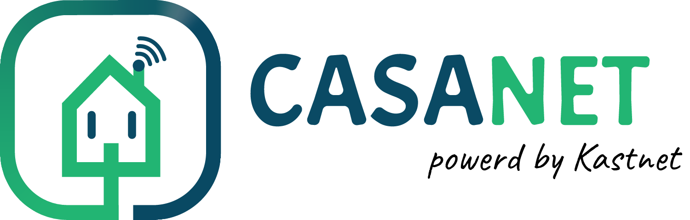

Let's create a smart home, without giving anyone access to our house 😊

## CASANET
Open-source server to control Smart Home IoT devices in a local network.

The latest release binaries available to download from [casanet-server releases](https://github.com/casanet/casanet-server/releases)

The dashboard app (APK) currently on alpha version only, temporary available [here](https://github.com/casanet/dashboard-app/actions/runs/1276262855).

## Philosophy
This project aims to resolve a number of issues plaguing most Smart Home systems

* *Lack of common interfaces*: Anyone who uses a number of smart devices (smart IR, smart sockets or anything of that kind) of different brands is familiar with the problem of having to deal with completely different applications, authentication methods, timings, operations etc. for each device.

* *Reliability & Stability*: To control home appliances from the internet, the devices communicate with the manufacture's servers, some of which belong to small companies that may "come and go" or have downtime issues. Client side service issues are also notoriously difficult to diagnose and resolve.

* *Accessibility*: Although that there is no good reason to disallow control of home appliances directly from the local network, most commercial home appliances allow control only via the manufacturer's servers, therefore rendering the device inoperable, (even from inside the LAN!) in case of connectivity issues.

* *Security*: The biggest problem with commercial IOT is security. We definitely do not want to entrust our home to any code produced by an IOT manufacturer as they are known for making some of the most insecure and dubious systems in existence. We want to use vetted, battle-tested and privacy oriented open-source assets in order to ensure the devices do not turn rouge or outright malicious. We want the ability to 
isolate our devices from the outside world whilst retaining all (or most) capabilities.  

As a solution to these problems, this project consolidates all the smart home appliances into one simple, clear and easy to access API.

The Casanet server can run on any computer type (x86, ARM) at home and does not required an internet connection to operate.

The Casanet server design is to manage abstract world devices and a collection of modules ("drives") for each physical device kind, to convert to/from an abstract device state to/from the physical device.

This allows to easily add support in vast devices kinds, and separately, control all of them in one dashboard, same timing/operation abilities and even open an easy to use modern API.

Each module/driver design to work only through a local network, let us disconnect the device for good from the internet.

## How does it look?

## ✨✨✨ [Live Demo Dashboard](https://demo.dashboard.casanet.casa/) ✨✨✨

### The web dashboard

### The mobile app

> For more details and information about the web & mobile interface see [dashboard-app](https://github.com/casanet/dashboard-app) repository.

### The web lightweight dashboard

The (very) lightweight dashboard (only about 20kb of total assets) for old phones or very slow networks.

For the lightweight interface navigate to `[server-ip/host]/light-app/index.html`.

> For more details and information about the lightweight interface see [lightweight-dashboard](https://github.com/casanet/lightweight-dashboard) repository.

> For the legacy dashboard see [frontend-v3](https://github.com/casanet/frontend-v3) repository.

## Running Casanet server on a local computer

To make it easy to use there are ready-to-use binaries [here](https://github.com/casanet/casanet-server/releases) just download the binary file (depend on your OS) and the `casanet.json` configuration file and run the executable file.

It's recommended to read the configuration section [here](./backend/README.md#configure-server). 

In order to set up Linux from scratch see [Linux deployment tutorial](./docs/LINUX.md) for a Linux based devices (for raspberry pi etc.)

## Project parts + technologies
* **[Casanet server](./backend/README.md):**
	* **Purpose:** Control the IoT devices in a local home network.
	* **Technologies:** [Node.js](https://nodejs.org/en/) (using TypeScript + [TSOA](https://github.com/lukeautry/tsoa)).
* **[Dashboard](https://github.com/casanet/dashboard-app):**
	* **Purpose:** Hybrid dashboard for web & mobile to control the IoT devices (using Casanet server API). 
	* **Technologies:** [react v17](https://reactjs.org/blog/2020/10/20/react-v17.html) (with [mui v5](https://mui.com/)) and [cordova](https://cordova.apache.org/).
* **[Remote server](https://github.com/casanet/remote-server):**
	* **Purpose:** Forward API requests from the wide internet to the local Casanet servers.
	* **Technologies:** [Node.js](https://nodejs.org/en/) (using TypeScript + [TSOA](https://github.com/lukeautry/tsoa) + [PostgreSQL](https://www.postgresql.org/)).
* **[Remote dashboard](https://github.com/casanet/remote-dashboard):**
	* **Purpose:** Management dashboard for the remote server admin (using remote server API)
	* **Technologies:** [Vue.js](https://vuejs.org/) (using [vue material](https://vuematerial.io/)).
* **[RF commands repository](https://github.com/casanet/rf-commands-repo):**
	* **Purpose:** Light-weight server to keep and serve RF commands (such as: IR, 433 MHz etc.) for appliances.
	* **Technologies:** Python 3.7.3 (using [Flask](https://palletsprojects.com/p/flask/) + [Mongodb](https://www.mongodb.com/)).
* **API (for local and remote server):**
	* **Technologies:** [Swagger](https://swagger.io/).

### Dashboard languages support
The UI is designed to support multi-Language using [i18](https://react.i18next.com/).

Current supported Languages:
* English
* Hebrew

Any support for other languages will be welcome.

## Accessing casanet server from the internet
The server needs to run on local home network. So, how does one access it via the local home network? How does one get access to the casanet local server from the internet?

#### Method 1: Port forwarding
Make sure that the IP address of your home is public and redirect ports in-home router to the computer that is running the casanet server.

(DDNS is recommended for easy access to the home IP address).

#### Method 2: Using casa remote server
The casa remote server is built for this, [casanet-remote](https://github.com/casanet/remote-server) run on cloud service and used to redirect API requests to the local server.

## Supported IoT devices / protocols

-  Orvibo (aka wiwo)

	-  S20 (socket). [link](https://www.aliexpress.com/item/2016-New-Orvibo-Home-Automation-EU-U-UK-AU-Standard-Smart-Power-Travel-Socket-Plug-4G/32793333967.html)

-  Broadlink

	-  SP3 (socket). [link](https://www.gearbest.com/smart-access-lock/pp_009282693865.html)
	-  RM mini 3 (As AC). [link](https://www.gearbest.com/alarm-systems/pp_009753807797.html)
	-  RM Pro (As AC / RF toggle / RF curtain). [link](https://www.gearbest.com/home-appliances-accessories/pp_009281768756.html)

-  Yeelight

	-  Light with temperature and brightness properties. [link](https://www.gearbest.com/round-ceiling-lights/pp_009555929473.html) and others.
	-  Light with RGBW properties. [link](https://www.gearbest.com/smart-bulbs/pp_009329720794.html) and others.
    
-  Tuya (aka smart life)

	-  Switch (3 or less gangs). [link](https://www.aliexpress.com/item/220V-EU-Standard-3-Gang-Control-LED-Indicate-TUYA-Smart-App-Light-Touch-Switch-work-with/32952608844.html) [link](https://www.aliexpress.com/item/WiFi-Smart-Boiler-Switch-Water-Heater-Smart-Life-Tuya-APP-Remote-Control-Amazon-Alexa-Echo-Google/32981607525.html) and others.
	-  Curtain switch. [link](https://www.aliexpress.com/item/Tuya-Smart-Life-WiFi-Curtain-Switch-for-Electric-Motorized-Curtain-Blind-Roller-Shutter-Google-Home-Amazon/33006009742.html) and others.

- Mi (aka xiaomi)
    
    -  Philips LED Ceiling Lamp. [link](https://www.gearbest.com/smart-ceiling-lights/pp_009933492211.html)
	-  Robot Vacuum. [link](https://www.gearbest.com/robot-vacuum/pp_440546.html)

- Tasmota
    
    - Switch (tested with [this](https://www.gearbest.com/robot-vacuum-accessories/pp_009661965579.html?wid=1433363) and [this](https://www.gearbest.com/alarm-systems/pp_009227681096.html?wid=1433363)) 
    - Air-conditioning (IR Transmitter) (tested with [this](https://www.aliexpress.com/item/33004692351.html) (after [flashing to Tasmota](https://blog.castnet.club/en/blog/flashing-tasmota-on-tuya-ir-bridge))

- [IFTTT](https://ifttt.com/discover) module. [module documentation](./backend/src/modules/ifttt/README.md)..

    - Toggle.
    - Switch.
    
- [MQTT](http://mqtt.org/) module. [module documentation](./backend/src/modules/mqtt/README.md).
    -  Toggle.
    -  Switch.
    -  Air-conditioning.
    -  Light
    -  Temperature light.
    -  Color light.
    -  Roller.
    
- Mock (for testing purpose)
    
    -  Toggle demo.
    -  Switch demo
    -  Air-conditioning demo.
    -  Light demo.
    -  Temperature light demo.
    -  Color light demo.
    -  Roller demo.
    
## Connecting devices

How to connect a device to the local network and how to add it to be managed by the casa-net server?

see [here](./backend/src/modules/README.md) the brands modules documentation.

## Adding other devices support
Yes, it is possible and it's welcomed! see [modules documentation](./backend/src/modules/README.md#-for-development-only-).

## API

To explorer the full API specs use [swagger UI](https://petstore.swagger.io/) and put `https://raw.githubusercontent.com/casanet/casanet-server/master/backend/src/swagger.json` in explorer input.

To try it out against the demo mock server go to [casanet-mock-server docs](https://casanet-mock-server.herokuapp.com/docs/#/)

For a running Casanet server use Swagger UI to make API calls in the `[local server IP]/docs` URL. 

## IFTTT integration

The [IFTTT](https://ifttt.com/discover) ecosystem is great ;)

Now, invoking triggers when a minion turned on/off or turning on/off minion when any IFTTT trigger invoked is possible.

The integration is using [WebHooks](https://ifttt.com/maker_webhooks) API.

Receiving invoked triggers allow only if the casa-net server accessible via public internet or via a remote server.

Invoking triggers when a device turned on/off the local server requires an internet connection.  

See [step by step instruction](./docs/IFTTT.md) to use IFTTT.

### The casanet server tested on
* Windows - 10/7
* Linux - Ubuntu
* Raspberry PI - Raspbian
* Orange PI - Armbian (Debian-based)

## Contributing
  
Feel free to open an issue with a bug report or feature to develop for the next version.

For any suggestions or help feel free to contact.

## Privacy Statement

This project *doesn't* include any type of data collection and tracking, all data is stored *only* in the machine where the server runs inside.

Keep the machine safe and secure to keep your data in your hands only.

Using this server is own your own risk, and could contain sensitive data such as your users' email, name, devices key, etc.
 
Please secure your network, server machine, and your data :)

## Credits
* Logo and UX consulting [Ofek Avergil](https://il.linkedin.com/in/ofek-avergil-348260144).

Shared with :heart: by kastnet.
