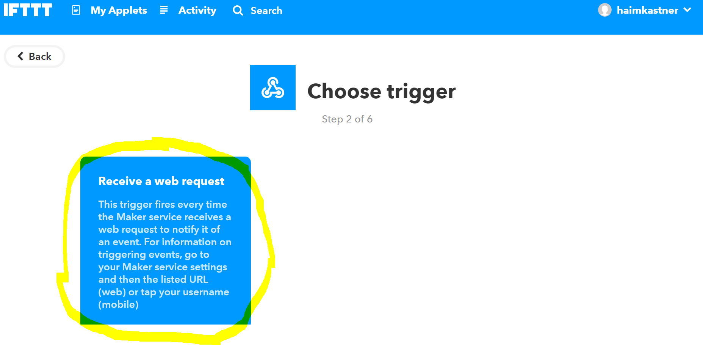

## Philosophy
The main goal of the current project is to control home kits in the local network without using any manufacturers services.
But, some of the devices not supported any API to control it in an offline network, for this case the IFTTT service is great.
It can allow control of any device that his manufacturer support Ifttt services.

> Note, this is not an Ifttt integration for the whole project,
To allow  turn on/off any device by any Ifttt trigger and to trigger by minion on/off event. see [Ifttt integration](../../../../README.md#ifttt-integration). 

## Implementation
Currently, the implementation of Ifttt interface is using Ifttt [WebHooks](https://ifttt.com/maker_webhooks).
because implementing of Ifttt service require main host that received Ifttt API calls,
but this project made to be totally in users hands and control. so using webhooks is the best option for it.

## Step by step instructions

### Create Ifttt account and minion.
1) Create an [IFTTT](https://ifttt.com/) account or login if already own one.
1) Connect [WebHooks](https://ifttt.com/maker_webhooks) to Ifttt account.
1) Watch and copy the webhooks API key.
    - Go to https://ifttt.com/maker_webhooks and press on `documentation`
        
    - Watch and copy the webhooks API key.
        
1) Create a new minion in casa-net with brand `ifttt` model `switch` or `toggle` and paste the webhooks API key as device id.
1) Copy the new minion inner-id from device meta.
    - Open the new minion menu and select `device meta`, then copy inner-id.
        

### Trigger turn on/off.
1) Go to [ifttt applets page](https://ifttt.com/my_applets) and press `new applet`.
1) Press on `+this` button.
1) Choose webhooks service. 
    - 
1) Choose the sebhooks trigger. 
    - 
1) In event name put the copied `inner-id` and the properties divided by `-`, 
    - for 'toggle' and 'switch': `[inner-id]-[status]`.
    - for 'airConditioning' : `[inner-id]-[status]-[mode]-[fanStrength]-[temperature]`.
    - for 'light' : `[inner-id]-[status]-[brightness]`.
    - for 'temperatureLight' : `[inner-id]-[status]-[brightness]-[temperature]`.
    - for 'colorLight' : `[inner-id]-[status]-[brightness]-[temperature]-[red]-[green]-[blue]`.
    - for 'roller' : `[inner-id]-[status]-[direction]`.

    then press `create trigger`.
    > Example for possible trigger name: `abc123-on` for a 'switch', `123abs-on-cold-med-21` for 'airConditioning', for the full options of the properties of minions status see in swagger the struct of the 'MinionStatus'. 
    - 
1) Press on `+that` button and select the Ifttt service and the action that turn the device on.
1) Create the same trigger for `off` operation.

For now, it's possible to turn on/off the device via casa-net and use the device as `toggle` minion.

To receive feedback from the device to know when the device turned on/off and use the device as `switch`,
Make sure casa-net accessible via public internet or via remote-server.

### Listen to device turned on/off.
1) Create a trigger to be invoked when the device turned on/off using the manufature Ifttt service.
1) Select WebHooks as an action service.
    - 
 1) Select make request action
    - 
 1) Set the HTTP request as following struct:
    - URL: `http://[casa-net server or remote server host/ip]/API/minions/[inner-id]/ifttt`.
    - Method: `PUT`.
    - Content-TypeL `application/json`.
    - Body: 
      ```
      { 
        "localMac":"f4********83",
        "deviceId": "hjg***Webhooks API key***kjhkjh",
        "newStatus": "on" 
      }
      ```
      localMac field is required only if using remote-server. to get the local mac-address `GET` `/API/remote/machine-mac`.
     - 

That's it ;).
