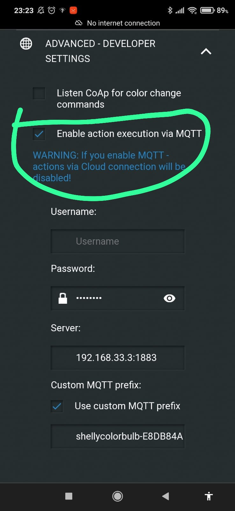
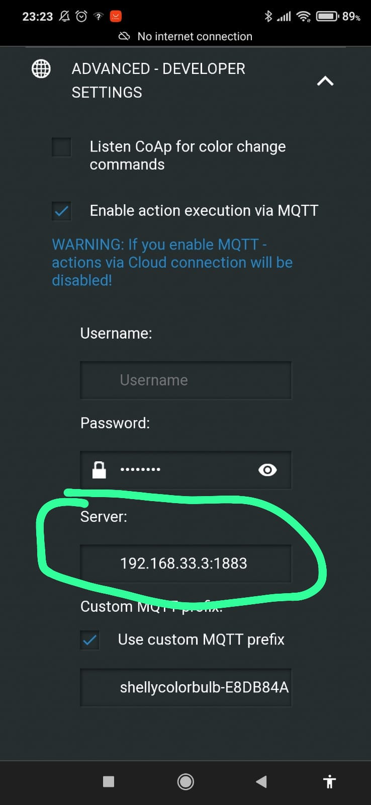
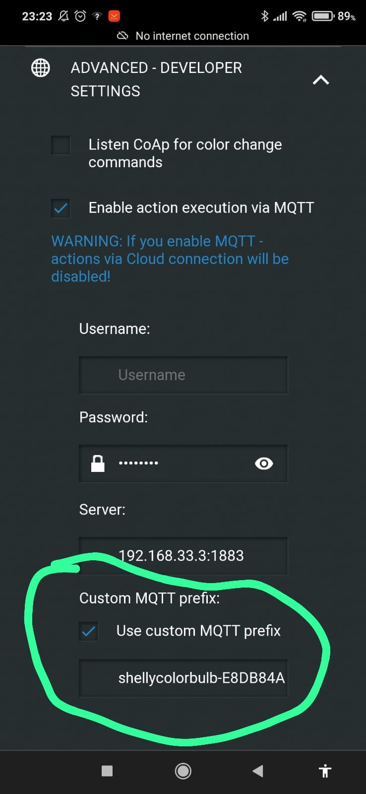

## Philosophy

The [MQTT](http://mqtt.org/) protocol design for IOT devices, and it is very easy to implement, so connect this project to MQTT system is should be a must ;).


## Implementation
The MQTT module is an MQTT client that subscribe to devices statuses updates and publish set/get status requests.

## Connect module to an MQTT broker
MQTT system is several clients that connect to one broker.

To connect the module to an exists broker set the `MQTT_BROKER_URI` env var (for example `mqtt://192.168.1.10:1883`).
To run internal broker leave empty the `MQTT_BROKER_URI` env var.
The default internal broker port is 1883 to change it sets `MQTT_INTERNAL_BROKER_PORT` env var.

## MQTT messages publish/subscribe structure

Since every device manufacture use slight different topic/payloads for controlling the device, the MQTT module holds a collection of drivers for each.

The MQTT driver needs to detect the topic, past a message into Casanet status structure, and convert set status into device's MQTT topic/payload.

### Casanet MQTT Driver

This driver is a generic driver, that publish and subscribes to `casanet/*` topic.


The driver subscribes to the topic `casanet/state/+`, to get the minion new status. 
while in the `+` place should be the minion id.
For example a valid topic `casanet/state/yg56rf`.

The body of the message should be a minion status (see swagger API for the structure).
For example (Filling only the current minion device type):
```javascript
    {
        "switch": {
          "status": "on"
        }
    }
```

The driver publishes to the topic `casanet/set/[minionId]`, to set the minion a new status.
For example `casanet/set/yg56rf`.

The body of the message is a minion status to set (see swagger API for the structure).
For example (It filling only the current minion device type):
```javascript
    {
        "switch": {
          "status": "on"
        }
    }
```

And also MQTT module publishes to the topic  `casanet/get/[minionId]` to get the current status (with an empty body).

### MQTT driver for Tasmota (sonoff)

Currently there is a driver for a tasmota simple switch devices only.

To use it:
1) Create a new minion in the dashboard, select brand `mqtt` and in the model `switch`.
1) Set any device Id string, and copy it for later.
1) In Tasmota web interface set the broker IP. (note that if not set any other broker to Casanet, the broker is the Casanet server IP).
1) In Tasmota web interface change the topic name to `sonoff/[deviceID]`. 
    - for example:
        

### MQTT driver for Shelly

Currently there is a driver for Shelly button, switch, and bulb color only.

To use it:
1) Open Shelly web interface, and enable MQTT (`Internet & Security -> Enable action exclusion via MQTT`).
    - 
1) Set MQTT Server set the broker IP. (note that if not set any other broker to Casanet, the broker is the Casanet server IP).
    - 
1) Enable custom MQTT prefix, and copy the value. 
    - 
1) Create a new minion in the dashboard, select brand `mqtt` and in the model select  `toggle`/`switch`/`color light`. 
1) Paste the device's custom MQTT prefix as the device ID.
        

## Implement converter
It should be very simple.
1) Create a new driver file, go to `backend/src/modules/mqtt/mqtt-drivers` directory and copy the `casanetMqttDriver.ts` and change the file name (to `xxxMqttDriver.ts`) and the class name `xxxMqttDriver`.
1) Change the topic to subscribe and the messages to send as required.
1) in the `../mqtt/mqttHandler.ts` (line ~153) add an instance of the `xxxMqttDriver` class to the drivers collection.
1) feel free for asking help or opening PR :)
