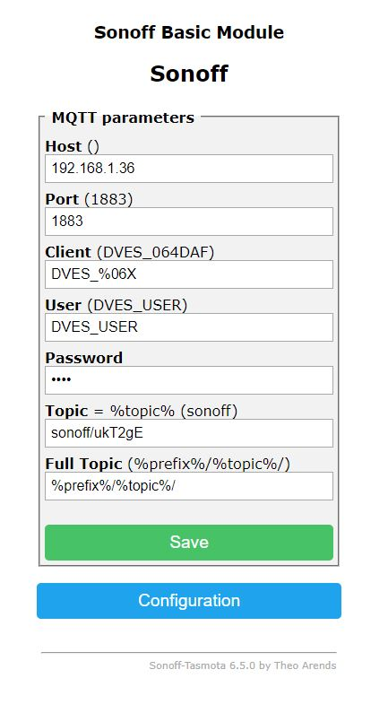

## Philosophy

The [MQTT](http://mqtt.org/) protocol design for iot devices, and it is very easy to implementation, so connect current project to MQTT system is shoul be mast ;).

## Implementation
The MQTT module is a MQTT client that subscribe to devices satatuses updates and publish set status requests.

## Connect module to MQTT broker
MQTT system is a several client that connect to one broker.

To tell the module the broker ip/port set the `MQTT_BROKER_IP` `MQTT_BROKER_PORT` env vars.
If IP not configurate is OK, the module will invoke broker internally and all MQTT clients (include MQTT module) ahould connect to it.

## MQTT messages publish/subscribe stracture

### MQTT module subscription
The MQTT module subscribe to the topic `stat/casanet/#`, to get the minion new status. 
while in the hashtag place should be the minion id.
For example a valid topic `stat/casanet/yg56rf`.

The body of message should be a minion status (see swagger aapi for the stractur).
For example (Filling only the current minion device type):
```javascript
    {
        "switch": {
          "status": "on"
        }
    }
```

### MQTT module publishing
The MQTT module publish to the topic `set/casanet/[minionId]`, to set the minion a new status. 
For example `set/casanet/yg56rf`.

The body of message is a minion status to set (see swagger aapi for the stractur).
For example (It filling only the current minion device type):
```javascript
    {
        "switch": {
          "status": "on"
        }
    }
```

### MQTT converter
If the device MQTT client not allowing to match the above topic/data. 
It possible to use converter to convert the device topic/data to the casanet topic/data struce.


#### MQTT with tasmota simple switch
Currently there is a converter for a tasmota simple switch devices.

To use it:
1) create new minion in the dashboard, select brand `mqtt` and in the model `switch`. 
1) copy the new minionId (by pressing on minion menu and then the device meta).    
1) in tasmota web interface set the broker ip. (note that if not set other broker to casanet, the broker is the casanet server ip).
1) in tasmota web interface change the topic name to `sonoff/[minionId]`. 
    - for example:
        
        

## Implement converter
It should be very simple.
1) create converter file, go to `mqtt-converters` directory and copy the `tasmotaConverter.ts` and change the file name (to `xxxConverter.ts`) and the class name `XxxxConverter`.
1) in the `subscribeDeviceTopic` data member set the topic to subscribe.
1) in the `convertToDevice` method implement the convertion from minion id and status to device set status topic/data.
1) in the `convertToCasanet` method implement the convertion form the new device status message to minion id and new minion status struct.
1) in the `mqtt/mqttHandler.ts` (line ~145) add an instance of the `XxxConverter` class to converters collection.
1) fill free for help or opening implementations PR ;)
